# ZH-split60-keymap

ZH-split60-keymap - это описание моей раскладки для сплит клавиатур с 60 клавишами (Ergohaven K03:PRO, Ergohaven HPDv2), которую я создавал для себя, и все удобства будут рассмотрены с моей точки зрения.

Верися 3. 2025-08-28

# Причины появления этого документа

После покупки первой программируемой клавиатуры, я сходу не смог привыкнуть к стандраной раскладке от Ergohaven, поэтому я постарался сделать раскладку, с которой мне было бы комфортее. Потом, я написал относительно большой пост про свою расладку в сообществе Ergohaven, и несколько человек даже попросили описать подробно: что и как у меня сделано. И мне пришлось более детально всё описать. 

На самом деле, этот документ - моя попытка описать свою раскладку. Прежде чем начать делать свою раскладку, настоятельно рекомендую пару раз перечитать статью Ильи Шупрута https://optozorax.github.io/p/my-keyboard-layout/

Чем больше я работают за программируемой клавиатурой, тем больше идей из этой статьи я тащу в свою раскладку.

# Общие принципы проектирования 
Это раскладка - мой первый опыт с программируемыми клавиатурами, поэтому я сделал основную раскладку максимально похожую к тому, к чему я привывык на стандартной клавиатуре (далее СК)

1. Базовые слои должны быть похожи на СК (стандартную клавиатру). Поэтому за основу взяты QWERTY/ЙЦУКЕН.
2. Я привык к огромному количеству хоткеев. Поэтому <KBD>CTRL</KBD>, <KBD>SHIFT</KBD>, <KBD>TAB</KBD> на левой половине и совпадают с обычной СК. Мой левый мизинец их без проблем находит.
3. Клавиша <KBD>ESC</KBD> подвинулась на свое место в левый верхний угол. Мои пальцы вполне уверенно ее находят.
4. <KBD>BACKSPACE</KBD> как на СК - справа вверху. Думал будет неудобно, но пальцы сами его нашли, ничего не могу поделать. Я сделал дублирование для него на навигационном слое. Но пока отказываться от расположения в правом верхнем углу не собираюсь.
5. Функциональные клавиши (F1..F10) на "навигационном" слое совпадают с цифрами (мыслетоплива тратиться меньше). Да, я активно пользуюсь функциональными клавишами и цифрами.
6. Точка и запятая должны находится на одних и тех же местах в слоях в RU/EN. Мне очень часто приходится переключаться между языками, и меня очень бесит все время искать эти знаки препинания. На СК я пользовался немного модифицированной универсальной раскладкой Никиты Широкова, и очень привык к такому положению.
7. "Точка c запятой"  <KBD>;</KBD> находится над "запятой" и набирается через <KBD>SHIFT</KBD> (тоже одинаково в RU/EN).  "Двоеточие" аналогично находится над точкой и набирается через <KBD>SHIFT</KBD>. Тоже наследие от универсальной раскладки. 
8. Пробел на правой руке.  Для левой руки и комбинаций <KBD>CTRL</KBD> +<KBD>SPACE</KBD> есть дубль под левую руку, через короткое нажатие на <KBD>ALT</KBD>  на левом тамблкастере)
9. Enter  на левой тамбкластере: часто когда рука на мышке , нужно нажать Enter.
10. Символы под цифрами  - как на обычной расклдке. Они частично проблировары в символьном слое.

И да, у меня мышка с 24 клавишами, и часть хоткеев есть на ней, но об этом, возможно, я напишу в другой раз.

# Описание слоев

0. Базовый
1. Навигация
2. Символы
3. Медиа и макросы (честно говоря я им не пользуюсь, это стандартный слой это ergohaven)
4. Мышиный  (я им тоже практически не пользуюсь)
5. Окна (запуск, программа, переключение, перемещение окон)
6. Доп символы (то что было в универсальной раскладке Широкова на <KBD>ALTGR</KBD>)
7. Нумпад
8. Пароли
11. Навигация между слоями

Начианая со второго слоя, левая верхняя клавиша (там где в базовом слое <KBD>ESC</KBD>) возвращает на "основной слой". Это на случай если я вдруг залутал между слоями.

## 0. Базовый слой

Весь слой на одной картинке:

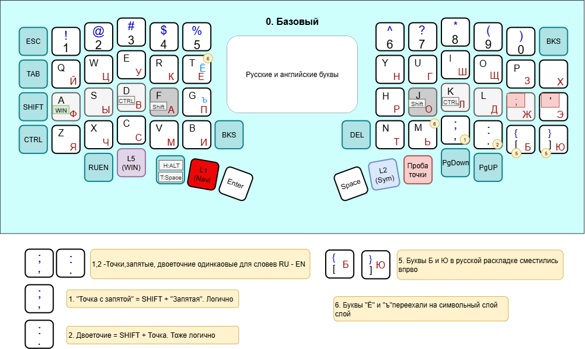

Далее пояснения как пользоваться...

### Языки и переключение между языками

1. Раскладка QWERTY/ЙЦУКЕН в одном слое. Переключение языков в операционной системе. Через  RuEn M1M2 (https://journey.ergohaven.xyz/pages/docs/ruen/#ruen-m1m2). Т.е в операционной системе у меня настроено переключение на мою английсткую раскладку : <KBD>ALT</KBD>+<KBD>SHIFT</KBD> +7. На русскую раскладку: <KBD>ALT</KBD>+<KBD>SHIFT</KBD> +8
2. В Vial соответсвенно есть макросы M1:

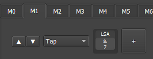 

Макорс M2:
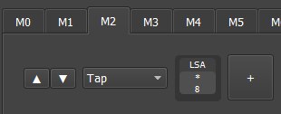

3.   Переключение слоев напрямую в базовом слое

   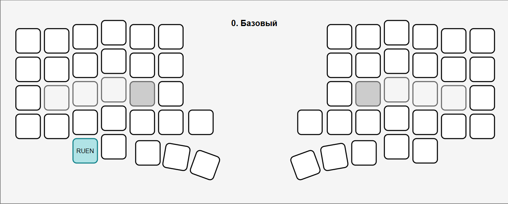

Клавиша переключения языков выедена под левую руку специально.

Сделано через TapDance:

* одиночное нажате: перключение RUEN

* двойное нажатие: EN

* долгоое нажание: RU

* Tap + hold : RU EN Sync

### Клавиши ESC, TAB,SPACE, ENTER  и модификторы CTRL, SHIFT

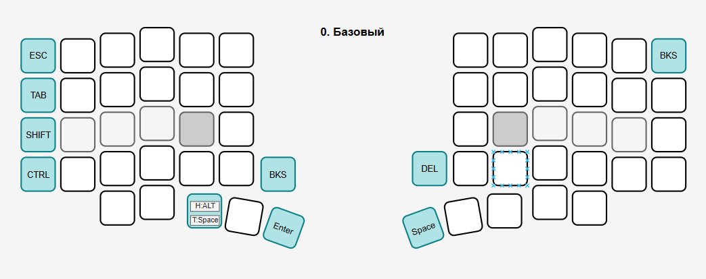

Клавиши <KBD>ESC</KBD>, <KBD>CTRL</KBD>, <KBD>SHIFT</KBD>, <KBD>TAB</KBD> на левой половине и совпадают с обычной СК. За много лет на стандартной клавиатуре мой мизинец так прокачалься, что мне такое положение не доставляет неудобств. Да и многое хоткеи уже отложились на подкоре мозга, и поэтому я решил оставить их не этих местах.

Клавишм <KBD>ALT</KBD> и <KBD>SPACE</KBD> на левой руке совмещены  через TapDance 3. Пробел на левой руке мне нужен для комбинаций <KBD>CTRL</KBD> +<KBD>SPACE</KBD>

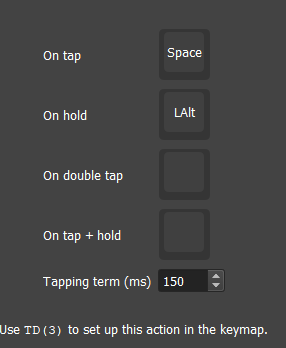

### Дубль управляющих клавиш в навигационном слое

Для удобства доступа левой рукой эти клавиши продублированы и навигационном слое

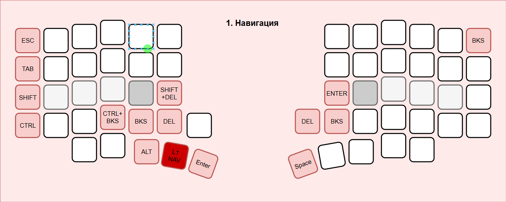

Цифры набирают обычным нажатием, символы через <KBD>SHIFT</KBD>,  как на обычной клавиатруе

### Изменения в QWERTY

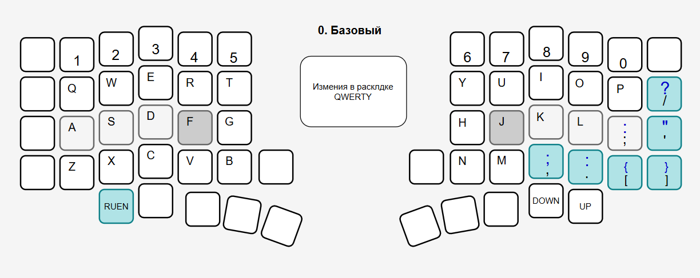

###  Изменения в ЙЦУКЕН

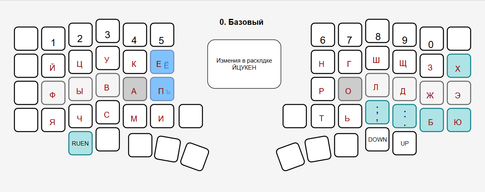

Буквы "Ё"и "ъ" перехали на символьный слой. Букв "Б", "Ю" сдивинулись вправо, "Х" на одну позицию влево. 

Измениния все сделаны через свою раскладку в  WINDOWS. Возможно более лучший варинат был бы сделать это через программу  kanata, но честно говоря я ее еще не ослил🤷‍♂️

### Модификаторы на HOME ROW

Я пробовал разместить станадраные Win, ALT, CTRL, SHIFT  на долгое нажатие, но в итоге у меня остались только SHIFT (на обоих половинах на <KBD>F</KBD>, <KBD>J</KBD> ) и Win  на левой половине.  Т.е. долгое нажитие на клавишу <KBD>J</KBD> будет считаться как SHIFT.

## 1. Навигационный слой

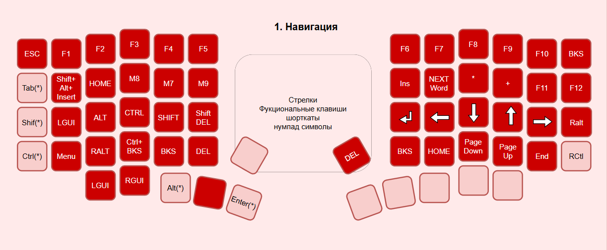

## 2. Символьный слой

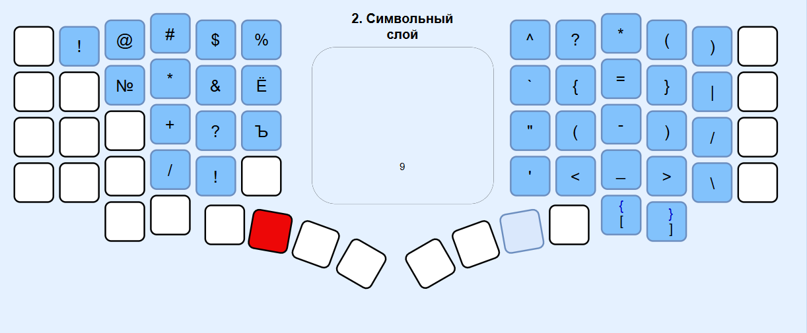

Логика следующая:

* Все кавычки в одном столбце (гравис, двойная, одинарная). Русские елочки остались в типографском слое.(TODO вынести в символьный слой)

* Все черточки <KBD>=</KBD> , <KBD>-</KBD>, <KBD>_</KBD> (равно, тире, подчеркивание) в одном столбце. Длинное тире в типографском слое (TODO вынести в символьный слой)

* Все горизонтальные черточки <KBD>|</KBD>, <KBD>/</KBD>, <KBD>\\</KBD> (вертикальная четра, слэш, обратнгый слэш)в одном стобце.
* Парные скобки в одном столбце
* Вопросительный и восклицатепльный знаки находятся рядом под указательным пальцем. Вопросительный знак на home row, как более частно встьречающийся
* "Плюс" на противоположной стороне минусу
* "Умножить" (или звездочка) над плюсом, как более сильная операция
* Знак <KBD>№</KBD> наверное нужно переместить на 3-ку как и на СК. (TODO)
* TODO верхний ряд заменить на символы из типографской раслкалдки (тогда и длинное тире, елочки, найдут свое место, как и знак &)
* TODO  вынести сюда несколько символов с нумпада, чтобы в farmanager  не нужен был слой с numpad

## 5. Слой управления окнами и приложениями

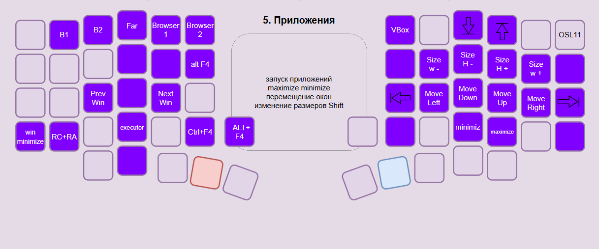

Перемещение окон, WinMinize сделано через программу AquaSnap, платная, но куплена очень давно (https://www.nurgo-software.com/products/aquasnap)

Запуск приложений черз Autohotkey и горячие клавиши

Executor -  это бесплатная программа под windows (https://executor.dk/).

OSL11 - Это переключение на слой по управлюеню слоями

В1, В2 - это вызов yndex browser  с разными профилями.

## 6. Слой типографики

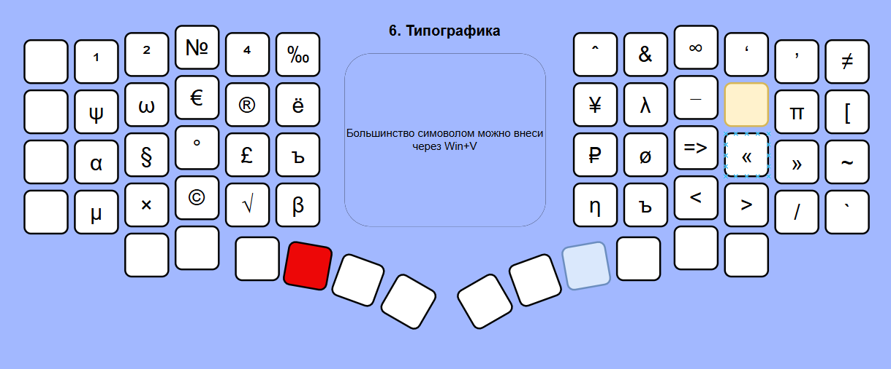

Не могу сказать что им я часто пользуюсь, все можно сделать через <KBD>WIN</KBD> + <KBD>V</KBD>

## 7. Нумпад

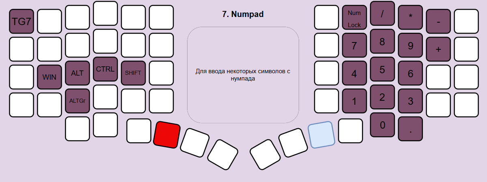

Очень редко бывает нужен

# Скрины Vial

## 00. Базовый

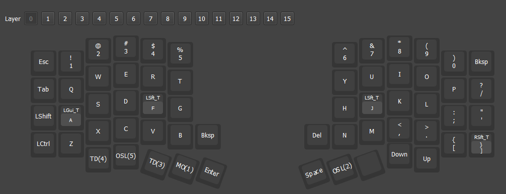

## 01. Навигационный

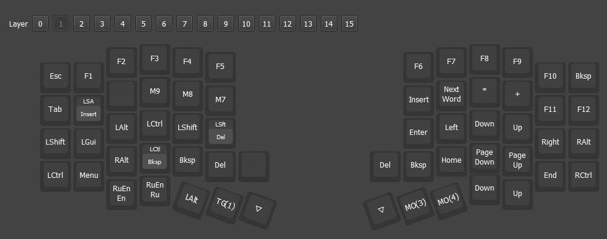

## 02. Символьный

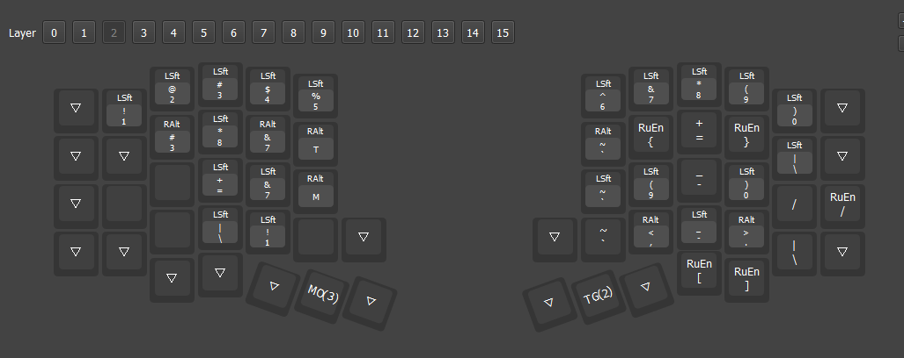

## 05. APP, WIN

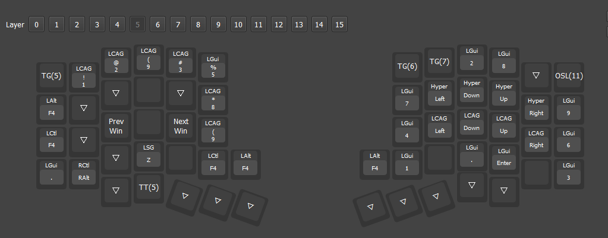

Для запуска приложений испольуется скрипт Autohotkey

Для управления окнами программа AquaSnap (https://www.nurgo-software.com/products/aquasnap). 

## 06. Типографика

## 07. Numpad

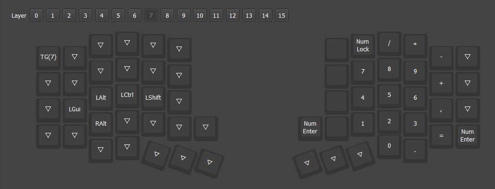

# TODO

## Базовый слой

### Левая полвинка

Переключение языка - не очень нравиться, но возможно это дело привычки.

Вызов слоя управления приложения  

Если эти две кнопки перенести, то можно туда вынести стрелки

 Перечитать еще раз Шепрута, 0

### Правая половинка

Одна свободная кнопка

# Ссылки

1. Расладка Ильи Шепрута (рус)  (https://optozorax.github.io/p/my-keyboard-layout/) Огромная статья  очень качественная статья, где описан весь опыт. Очень многое мне знакомо и это отобразилось в моей раскладке. Рекомендую перечитывать время от времени.
2. Очень классно с интерактивными примерами (в том числе символьный слой для программистов) но на для  GLOVE80  (https://sunaku.github.io/moergo-glove80-keyboard.html)
3. Тот же автор но для  для 58 клавиш:  (https://sunaku.github.io/ergohaven-remnant-keyboard.html)

4. На keyboard-layout-editor человек не поленился объяснил всю логику
    40%, 44 клавиши: (https://www.keyboard-layout-editor.com/#/gists/9740d2bf0e1b98644100a7caa60be88a)

5. Ну и как же без универсальной раскладки Никиты Широкова (на ней и сижу)
    https://github.com/braindefender/universal-layout

6.  Описание раскладки Miryoku (как  пишут легенарной): https://github.com/manna-harbour/miryoku#readme      

7.  Руководство по Home ROW MODS: https://precondition.github.io/home-row-mods     
